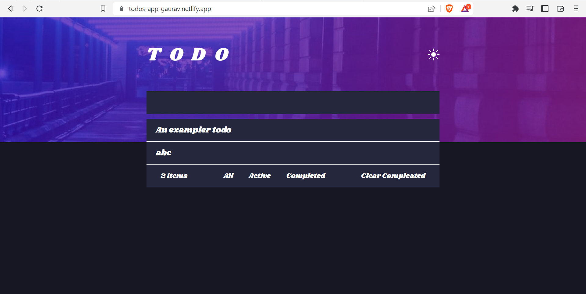
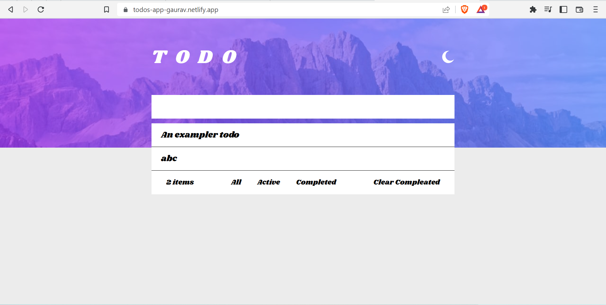

# Todo App React

### Netlify :- https://todos-app-gaurav.netlify.app/ 

## Table of contents

- [Overview](#overview)
  - [The challenge](#the-challenge)
  - [Screenshot](#screenshot)
- [My process](#my-process)
  - [Built with](#built-with)
- [Author](#author)

## Overview

### The challenge

Users should be able to:

- Toggle light and dark mode
- Add new todos to the list
- Mark todos as complete
- Delete todos from the list
- Filter by all/active/complete todos
- Clear all completed todos

### Screenshot

## My process

### Built with

- [React](https://reactjs.org/) - JS library
- CSS3
- JSX
- CSS Flexbox

## Author

- GitHub - [Gauravtripathii](https://github.com/Gauravtripathii)
- Frontend Mentor - [@Gauravtripathii](https://www.frontendmentor.io/profile/Gauravtripathii)
- Twitter - [@gaurav0tripathi](https://twitter.com/gaurav0tripathi)
- LinkedIn - [Gaurav Kumar Tripathi](https://www.linkedin.com/in/gaurav-kumar-tripathii/)
